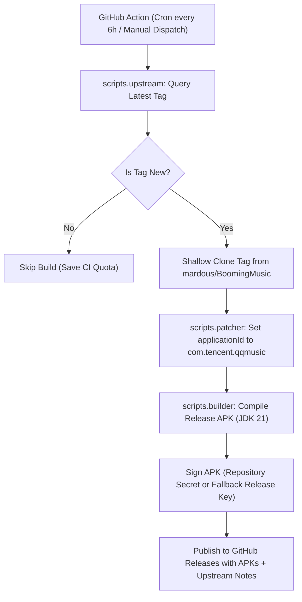

# BoomingMusic Package Name Changer & Auto-Releaser

Automated CI/CD suite that monitors upstream releases of [BoomingMusic](https://github.com/mardous/BoomingMusic), changes the Android application ID to `com.salt.music` (or any other package from the OnePlus/OPPO whitelist), compiles the release APKs, and publishes them directly to your repository's GitHub Releases.

---

## 🎯 Purpose

Certain smartphone manufacturers (particularly **OnePlus**, **OPPO**, and **Realme**) whitelist specific media players to activate system-level audio enhancements such as:
- **Dolby Atmos** (Music / Movie / Smart profiles)
- **Dirac Audio Tuner**
- **OReality Audio**

By rewriting the package ID to an audio-whitelisted package name like `com.salt.music`, the operating system treats BoomingMusic as a recognized music application and applies full hardware audio post-processing without triggering OxygenOS's aggressive stock icon overrides (which happen with popular Chinese apps like `com.tencent.qqmusic`).

A full list of recognized package names is available in [`OnePlus-Whitelist.txt`](OnePlus-Whitelist.txt).

---

## 🚀 How It Works



---

## ⚙️ Triggering the Workflow

### 1. Automatic Monitoring
The GitHub Action runs automatically every **6 hours** via a cron schedule (`0 */6 * * *`). If upstream releases a new tag (e.g., `v1.4.0`), the workflow detects it, compiles the APK, and creates a release in this repository.

### 2. Manual Dispatch (On-Demand)
You can trigger the workflow at any time from your GitHub repository:
1. Go to the **Actions** tab in your repository.
2. Select **Upstream Sync & Whitelist Package Release**.
3. Click **Run workflow**.
4. (Optional) Customize the inputs:
   - **Target Tag**: Specify a specific version (e.g. `v1.4.0`) or leave blank for the latest release.
   - **Package Name**: Default is `com.tencent.qqmusic`. You can enter any package from `OnePlus-Whitelist.txt`.
   - **Force Build**: Check this box to force a rebuild even if a release already exists for that tag.
   - **Flavor**: Choose `github` (recommended, includes built-in updater and lyrics) or `fdroid`.

---

## 🔐 Keystore & Signing Secrets (Optional)

The workflow includes an **automatic fallback**: if no keystore secrets are configured, it generates a self-signed release key on the fly so the build always succeeds and produces an installable APK.

To keep the same signature across all updates (so you can install new releases over old ones without uninstalling):
1. Generate your own Android keystore locally:
   ```bash
   keytool -genkeypair -v -keystore my-release-key.jks -alias my-alias -keyalg RSA -keysize 2048 -validity 10000
   ```
2. Convert the keystore file to base64:
   - On Windows (PowerShell):
     ```powershell
     [Convert]::ToBase64String([IO.File]::ReadAllBytes("my-release-key.jks")) | Set-Clipboard
     ```
   - On Linux / macOS:
     ```bash
     base64 -w 0 my-release-key.jks
     ```
3. In your GitHub repository, go to **Settings > Secrets and variables > Actions > New repository secret**:
   - `SIGNING_KEY_BASE64`: Paste the base64 string.
   - `KEY_ALIAS`: Keystore alias (e.g. `my-alias`).
   - `KEY_PASSWORD`: Password for key.
   - `STORE_PASSWORD`: Password for keystore.

---

## 💻 Local CLI Usage

You can also run the modular automation suite locally on your computer:

### 1. Check for New Upstream Releases
```bash
python -m scripts.main check --upstream mardous/BoomingMusic
```

### 2. Patch Package Name
```bash
# Dry run to preview changes
python -m scripts.main patch --package com.tencent.qqmusic --dry-run

# Apply change to BoomingMusic/app/build.gradle.kts
python -m scripts.main patch --package com.tencent.qqmusic
```

### 3. Sync & Clone Specific Upstream Version
```bash
python -m scripts.main sync --tag v1.4.0 --package com.tencent.qqmusic --dir BoomingMusic
```

### 4. Build APK Locally
```bash
python -m scripts.main build --flavor github --dir BoomingMusic
```

---

## 📦 Project Structure

```
Package-Name-Change/
├── .github/
│   └── workflows/
│       └── sync-and-release.yml    # GitHub Actions CI/CD pipeline
├── scripts/                        # Modular Python automation suite
│   ├── __init__.py
│   ├── config.py                   # Configuration and defaults
│   ├── upstream.py                 # GitHub API release detection
│   ├── patcher.py                  # Gradle applicationId modifier
│   ├── builder.py                  # Gradle runner and keystore manager
│   └── main.py                     # CLI entrypoint with subcommands
├── BoomingMusic/                   # Local workspace / submodule clone
├── OnePlus-Whitelist.txt           # OnePlus/OPPO whitelist package list
├── adb_tools.py                    # Local ADB development helper
├── .gitignore
└── README.md
```
